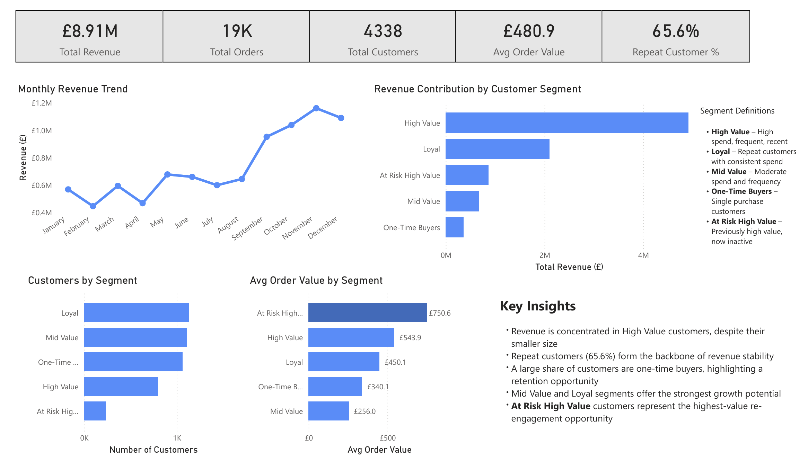

# Customer Analytics & Segmentation Dashboard

A Power BI dashboard designed to analyse customer behaviour, identify high-value segments, and uncover opportunities to improve retention and revenue.

---

## Project Overview

I built this project to simulate a real-world client engagement focused on customer analytics.

The goal was to move beyond basic reporting and instead answer key commercial questions:

* Where is revenue really coming from?
* Which customers drive the most value?
* Which customers are at risk of being lost?
* Where should the business focus to increase revenue?

This dashboard translates transactional data into clear, actionable insights for decision-makers.

---

## Key Business Questions Answered

* Which customer segments contribute the most revenue?
* How dependent is the business on high-value customers?
* What proportion of customers are repeat vs one-time buyers?
* Which customer groups present the biggest growth opportunity?
* Are there high-value customers at risk of churn?

---

## Dashboard Preview



---

## Key Insights

* Revenue is heavily concentrated in **high-value customers**, despite them representing a smaller share of the customer base
* **Repeat customers (65.6%)** form the backbone of revenue stability
* A large proportion of customers are **one-time buyers**, highlighting a clear retention opportunity
* **Mid Value and Loyal segments** represent the strongest opportunity for scalable growth
* **At Risk High Value customers** have the highest average order value, indicating significant revenue risk if not re-engaged

---

## Customer Segmentation Logic

Customers were segmented using an RFM (Recency, Frequency, Monetary) framework:

* **High Value** – High spend, frequent, recent customers
* **Loyal** – Consistent repeat buyers with stable spending
* **Mid Value** – Moderate spend and purchase frequency
* **One-Time Buyers** – Customers with a single purchase
* **At Risk High Value** – Previously high-value customers who have not purchased recently

This segmentation allows the business to prioritise actions based on customer value and behaviour.

---

## Tools & Techniques Used

* **Python (Pandas)**

  * Data cleaning and preparation
  * Customer-level aggregation
  * RFM feature engineering

* **Power BI**

  * Data modelling and relationships
  * DAX measures for KPIs
  * Interactive dashboard design

* **Key Metrics Developed**

  * Total Revenue
  * Total Orders
  * Average Order Value
  * Repeat Customer Rate
  * Customer Segmentation (RFM-based)

---

## Business Recommendations

Based on the analysis, the business should:

* **Protect high-value customers**
  Prioritise retention strategies for the segment driving the majority of revenue

* **Re-engage at-risk high-value customers**
  Targeted campaigns could recover significant lost revenue

* **Convert one-time buyers into repeat customers**
  Introduce incentives, email flows, or loyalty programmes

* **Scale mid-value and loyal segments**
  These groups offer the most efficient growth opportunity

---

## Project Structure

```plaintext
customer_analytics_segmentation_dashboard/
│
├── README.md
├── customer_analysis.ipynb
├── Customer_Analytics_Segmentation_Dashboard.pbix
└── images/
    └── dashboard_overview.png
```

---

## About This Project

This project is part of my portfolio as a freelance data analyst, focused on helping e-commerce businesses:

* Understand customer behaviour
* Improve retention
* Increase revenue through data-driven decisions

---

## Contact

If you're interested in similar analysis for your business, feel free to get in touch.
